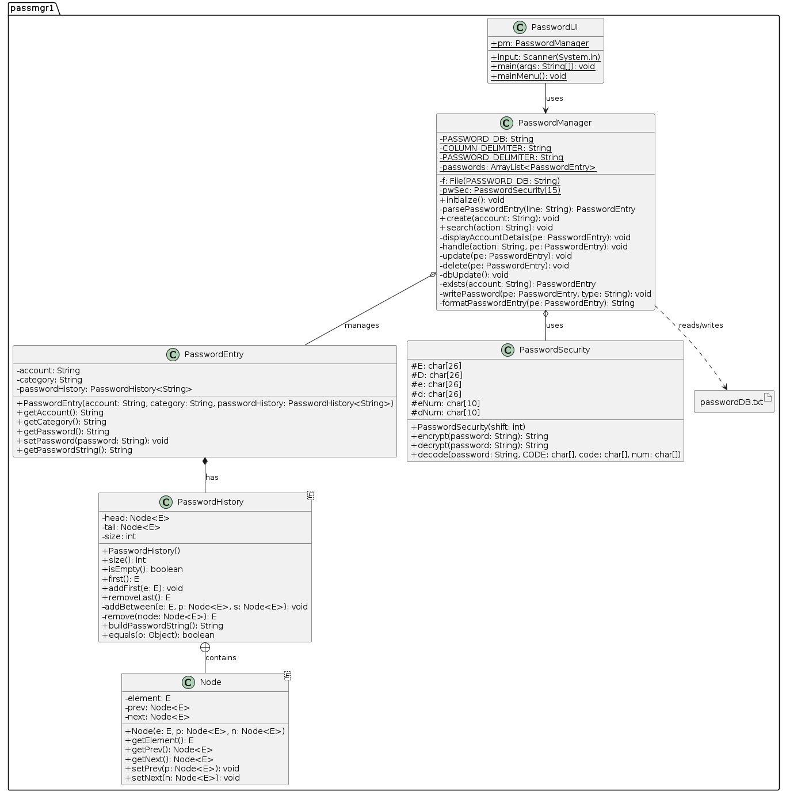
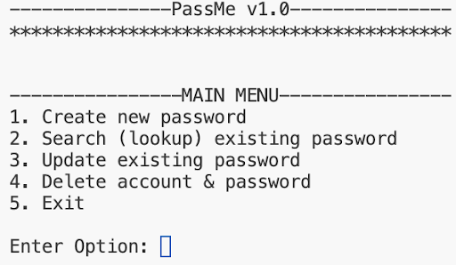

# Password Manager v1.0 (PassMe)

## Description  

PassMe v1.0 is a local password management application built in Java. It provides essential functionality for creating, updating, searching, and deleting passwords, with version history support for up to 5 previous passwords. Passwords are encrypted for security using a custom Caesar Cipher and stored locally in a plain text file.

---

### Features  

1. **Password Creation**:  
   - Add new passwords along with account name and category.  
   - Prevent duplicate accounts through case-insensitive checks.  
   - Maintain version history for the 5 most recent passwords.  

2. **Search and Update**:  
   - Search for existing accounts by name or URL.  
   - Update passwords: encrypt and replace current passwords, maintaining version history.  

3. **Password Deletion**:  
   - Delete accounts and associated passwords after confirmation.  

4. **Encryption**:  
   - Uses a custom Caesar Cipher (shift of 15) to secure passwords.  

5. **Version History**:  
   - Stores up to 5 recent passwords per account using a custom **Doubly Linked List**.  

---

### Key Data Structures  

1. **PasswordHistory**:  
   - A custom Doubly Linked List for maintaining password version history.  

2. **PasswordEntry**:  
   - Represents an account, storing name, category, and encrypted password history.  

3. **ArrayList**:  
   - Used for storing and managing all `PasswordEntry` objects in memory.  

---

### Class Diagram

---

### UI

---

### Tech  

- **Language**: Java  
- **File Storage**: Plain text file (`passwordDB.txt`) for persistent account data.  
- **Encryption**: Custom Caesar Cipher implementation.  
- **Data Structures**: Doubly Linked List and ArrayList.  

---

### Workflow  

1. **Initialization**:  
   - Loads existing `passwordDB.txt` or creates a new file.  

2. **Main Menu Options**:  
   - Create Password  
   - Search for Account  
   - Update Password  
   - Delete Account  
   - Exit  

3. **Error Handling**:  
   - Ensures valid user input and prevents invalid selections.  

---

### Complexity Overview  

| Feature                | Time Complexity         |  
|------------------------|--------------------------|  
| Create Password        | O(k + n + m)            |  
| Search Account         | O(k + n)                |  
| Update Password        | O(k + n + k*m)          |  
| Delete Account         | O(k + n + k*m)          |  
| Encrypt / Decrypt      | O(n)                    |  

*`k` = number of accounts, `n` = password length, `m` = metadata length.*  

---

### Learning Outcomes  

- **Data Structures**: Built and integrated a custom Doubly Linked List for password version history.  
- **Encryption Techniques**: Developed a custom Caesar Cipher for securing passwords.  
- **Algorithm Analysis**: Evaluated time complexities for core CRUD operations.  
- **Java Programming**: Gained experience with file handling, collections, and user input validation.  

---

### How to Run  

1. Compile all Java classes.  
2. Run the main class (`PasswordUI.java`).  
3. Follow the on-screen prompts from the console-based UI.
