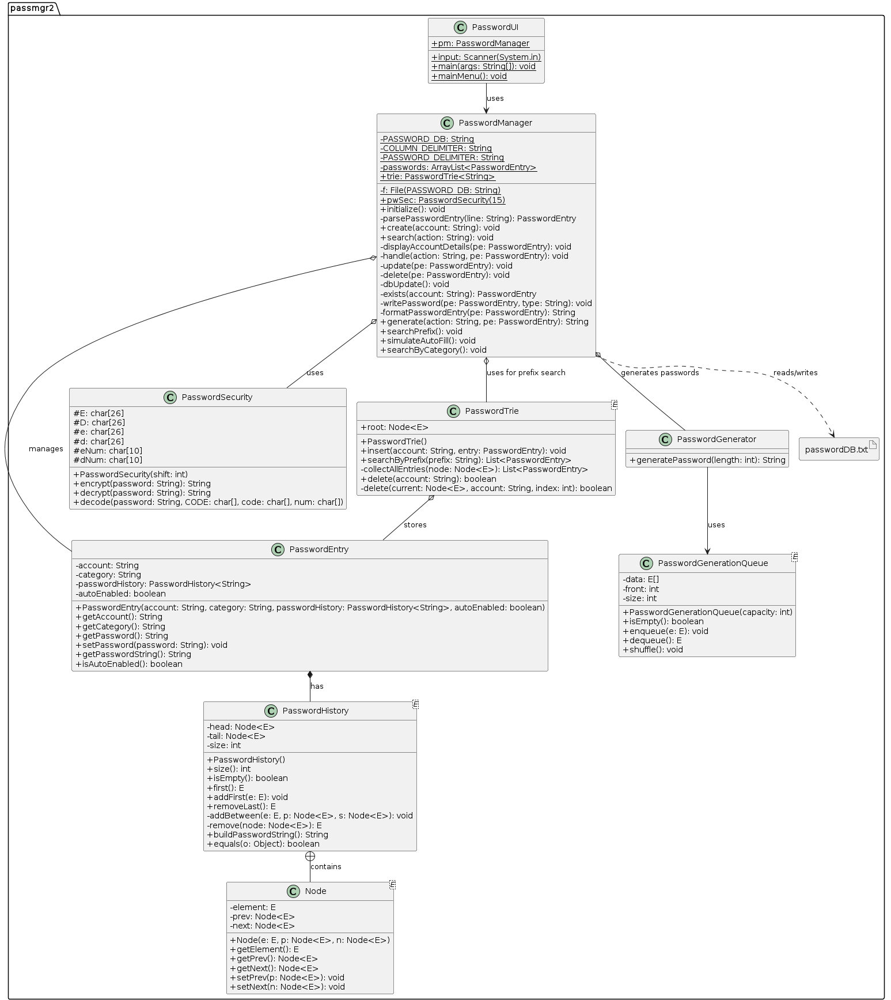
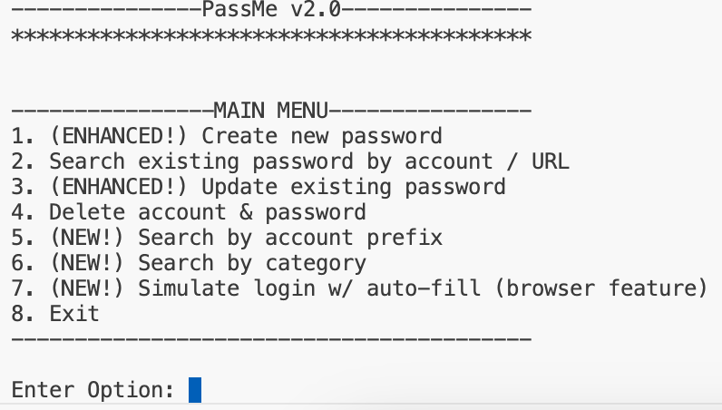

# Password Manager v2.0 (PassMe)

## Description  

PassMe v2.0 is a local password management application built in Java, designed for secure password creation, storage, and management. It builds on the original version with enhanced features like auto-generated strong passwords, search by prefix, account categorization, and simulated login capabilities.  

---

### Features  

1. **Password Creation**:  
   - Generate strong passwords automatically or enter manually.  
   - Store metadata: account name, category, and auto-fill enabled status.  
   - Maintain version history (up to 5 previous passwords).  

2. **Search and Update**:  
   - Search by account name (case-insensitive).  
   - Update passwords: generate new, reuse previous, or enter manually.  

3. **Advanced Search**:  
   - Search accounts by prefix using a **PasswordTrie**.  
   - Search by category for organized account management.  

4. **Simulate Login**:  
   - Supports auto-fill for quick access.  
   - Manual password verification for non-auto-fill accounts.  

5. **Encryption**:  
   - Uses a custom Caesar Cipher (shift of 15) to encrypt/decrypt all stored passwords.  

---

### Key Data Structures  

1. **PasswordTrie**:  
   - Supports efficient prefix-based account searches.  

2. **PasswordHistory**:  
   - A custom doubly linked list to maintain the 5 most recent passwords for each account.  

3. **PasswordGenerationQueue**:  
   - Ensures balanced, randomized password generation with a queue structure.  

---

### Class Diagram

---

### UI

---

### Tech

- **Language**: Java  
- **File Storage**: Plain text file (`passwordDB.txt`) for persistent account data.  
- **Encryption**: Custom Caesar Cipher implementation.  
- **Data Structures**: Trie, Doubly Linked List, and Queue.  

---

### Workflow  

1. **Initialization**:  
   - Creates or loads `passwordDB.txt`.  
   - Ensures backwards compatibility for legacy databases.  

2. **Main Menu Options**:  
   - Create Password  
   - Search for Account  
   - Update Password  
   - Delete Account  
   - Search by Prefix  
   - Search by Category  
   - Simulate Login  
   - Exit  

3. **Error Handling**:  
   - Validates user input for robustness and usability.  

---

### Complexity Overview  

| Feature                | Time Complexity |  
|------------------------|-----------------|  
| Create Password        | O(n)            |  
| Search Account         | O(n)            |  
| Update Password        | O(n)            |  
| Delete Account         | O(n*m)          |  
| Search by Prefix       | O(p + r*k)      |  
| Search by Category     | O(n)            |  
| Simulate Login         | O(n)            |  

*`n` = total accounts; `k` = password length; `m` = DB size; `p` = prefix length; `r` = matching accounts.*  

---

### Learning Outcomes  

- **Data Structures**: Implemented and integrated Trie, Linked List, and Queue.  
- **Encryption Techniques**: Built a custom Caesar Cipher for password security.  
- **Algorithm Analysis**: Optimized time complexity for core operations.  
- **Java Programming**: Leveraged object-oriented programming principles for modular design.  

---

### How to Run  

1. Compile all Java classes.  
2. Run the main class (`PasswordUI.java`).  
3. Follow on-screen prompts from the console-based UI.  
